  

 

  

 

  

 

  

 

  

### Selected work

- **[SkySweep32](https://github.com/bobberdolle1/SkySweep32)** — `C++ / ESP32` — multi-band passive drone detector, 900MHz / 2.4GHz / 5.8GHz RF scanner
- **[openflash](https://github.com/bobberdolle1/openflash)** — `Rust` — NAND/eMMC/NOR flash programmer on $4 microcontrollers
- **[unbound](https://github.com/bobberdolle1/unbound)** — `Lua` — packet-level DPI bypass, no VPN tunnels, zero speed loss
- **[BeamNG.WorldForge](https://github.com/bobberdolle1/BeamNG.WorldForge)** — `Python` — real-world map generation from satellite data
- **[maixcam-servo-control](https://github.com/bobberdolle1/maixcam-servo-control)** — `Python / YOLOv8` — autonomous ballistic servo drop with optical flow
- **[Project-OLEG](https://github.com/bobberdolle1/Project-OLEG)** — `Python / Gemini` — твой личный кибер-кентуха

 

  
  

  Ivanovo, RU · <code>while alive: vibe(); ship(); repeat()</code>

