

  

 

  

 

  

 

  

 

  

<!-- projects:start -->
<!-- generated by generate_assets.js — edit that file, not this block -->

  <a href="https://github.com/bobberdolle1/SkySweep32">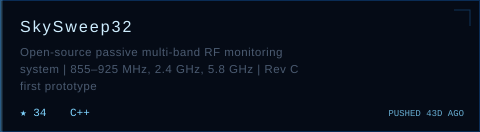</a>
  <a href="https://github.com/bobberdolle1/openflash">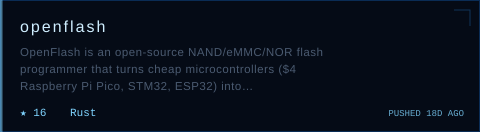</a>
  <a href="https://github.com/bobberdolle1/unbound">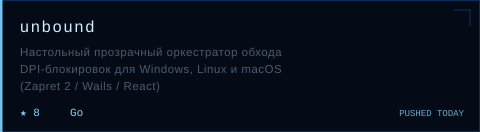</a>
  <a href="https://github.com/bobberdolle1/BeamNG.WorldForge">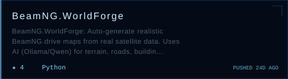</a>
  <a href="https://github.com/bobberdolle1/Pico-Nand-Flasher">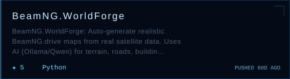</a>
  <a href="https://github.com/bobberdolle1/Project-OLEG">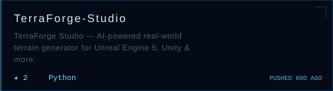</a>

<!-- projects:end -->

 

  <a href="https://t.me/norevived">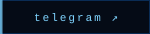</a>
  <a href="https://github.com/bobberdolle1">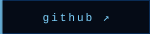</a>

  Ivanovo, RU · <code>while alive: vibe(); ship(); repeat()</code>

